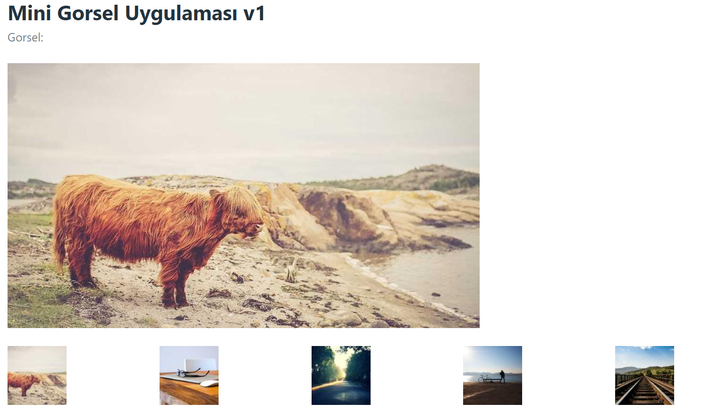

# Mini-Gorsel-Uygulamasi
Minik bir görsel uygulaması react js ile yapılmıştır.

## Yapılıcak İşlemler
1. Pico CSS kullanılıcak
2. Ana görsel olacak
3. Hemen altta 5 adet küçük görsel olacak
4. Küçük görsellerden birine tıklanınca ana görsel değişicek
5. Görseller Lorem Picsum'dan gelecek
6. Default olarak 100 no'lu id seçilicek
7. Görseller array olarak [200,201,202,203,204]

